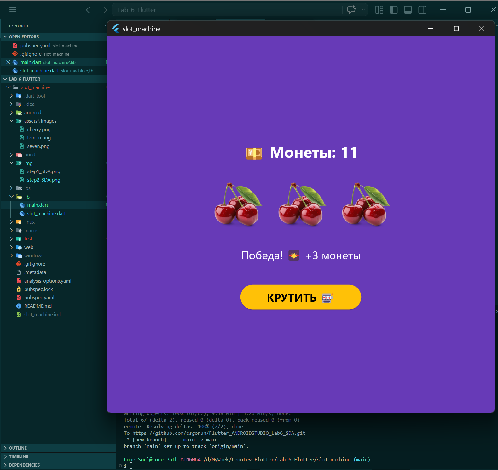

# Лабораторная работа №6. Flutter: StatefulWidget и управление состоянием

**Студент:** SDA
**Группа:** ISP-232
**Дата сдачи:**  08.05.2026

---

## 📚 Что изучили
1. **Архитектура состояний:** разницу между `StatelessWidget` и `StatefulWidget`, а также принцип реактивного обновления интерфейса через `setState()`.
2. **Работа с ресурсами:** подключение локальных изображений, настройку `pubspec.yaml` и корректное отображение ассетов с помощью `Image.asset()`.
3. **Управление UI и асинхронностью:** обработку нажатий, работу с `async/await`, паттерн «раннего выхода» (`early return`) и безопасную блокировку элементов интерфейса во время выполнения операций.
4. **Анимации и рефакторинг:** использование `AnimatedOpacity` и `AnimatedSwitcher` для плавных переходов, а также вынесение повторяющейся логики отображения в переиспользуемые виджеты (`SlotRow`).

---

## 📸 Скриншот финального приложения


> 💡 *Замените путь на актуальное имя файла скриншота, сохранённого в папке `img/`.*

---

## 🚀 Инструкция по запуску

1. **Убедитесь в наличии Flutter SDK**  
   Если Flutter ещё не установлен, следуйте официальной инструкции: https://flutter.dev/docs/get-started/install

2. **Клонируйте репозиторий и перейдите в папку проекта**
   ```bash
   git clone <URL_ВАШЕГО_РЕПОЗИТОРИЯ>
   cd Flutter_Lab6
   ```

3. **Установите зависимости**
   ```bash
   flutter pub get
   ```

4. **Запустите приложение**  
   Для запуска в браузере Chrome выполните:
   ```bash
   flutter run -d chrome
   ```
   *Для остановки приложения нажмите клавишу `q` в терминале.*

5. **Проверка работы**  
   После запуска нажмите кнопку **«КРУТИТЬ»**. При совпадении трёх одинаковых символов счёт монет увеличивается. При достижении `0` монет кнопка автоматически блокируется, а доступной становится кнопка **«Начать заново»**.


